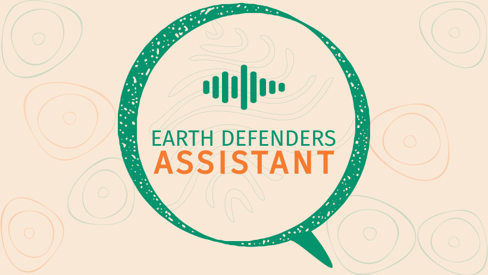

<h1 align="center"><b>Earth Defenders Assistant 🗨️</b></h1>

    <strong>Earth Defenders Assistant</strong> is a dynamic platform for creating WhatsApp bots for low-literate communities. This system facilitates the offline deployment of customized audio-first bots through a flexible plugin architecture, supporting a wide range of applications.
     
     
    
    
    
    
    
     
     
    <a href="#overview"><strong>Overview</strong></a> · 
    <a href="#features"><strong>Features</strong></a> · 
    <a href="#usage"><strong>Usage</strong></a> ·
    <a href="#roadmap"><strong>Roadmap</strong></a> ·
    <a href="#contributing"><strong>Contributing</strong></a> ·
    <a href="#license"><strong>License</strong></a>

## 🛖 Overview

**Earth Defenders Assistant** is a platform designed to empower Indigenous and local communities in their efforts to protect critical ecosystems. It bridges modern AI technology with traditional knowledge systems through three foundational components:

1. **🗣️ Voice-First Accessibility:**
   - **Natural Voice Interactions:** Allows users to engage with the platform using voice messages, making technology intuitive and accessible, especially for oral-first cultures.
   - **Broad Reach:** Leveraging WhatsApp's widespread usage ensures that even users with basic feature phones and little digital literacy can interact with advanced AI tools.

2. **🖥️ Community Owned Infrastructure:**
   - **Local Data Ownership:** The whole infrastructure can run locally, ensuring data is processed and stored locally, respecting community autonomy and privacy.
   - **Resilience in Connectivity-Challenged Areas:** Operates effectively without constant internet connectivity, providing reliable access to tools and information in resource-limited settings.

3. **🤖 Customized Assistants:**
    - **Flexible Plugin System:** Create and deploy custom plugins to extend bot functionality for specific community needs - from environmental monitoring to cultural preservation
    - **Knowledge Integration:** Import community-specific knowledge bases and cultural content to ensure the bot provides locally relevant and culturally appropriate responses
    - **Offline-First Design:** Plugins work seamlessly in low-connectivity environments, with local processing and storage capabilities

**Earth Defenders Assistant** bridges AI technology with community empowerment by integrating advanced AI solutions with intuitive interfaces. This ensures accessibility for all individuals, regardless of literacy or technological familiarity. The platform is dedicated to preserving cultural integrity by adapting AI technologies to reflect and uphold the unique values, languages, and knowledge of Indigenous communities.

**Community autonomy** is enhanced through tools that promote self-sufficiency, allowing communities to manage their data and resources independently. This approach supports reducing external reliance and fostering local control over technological resources.

## 🚀 Features

- **Flexible Plugin Architecture:** Easily add, update, or remove plugins to extend functionality.
- **User-Friendly Interface:** Designed with simplicity in mind to cater to users of all skill levels.
- **Local-First:** All components but WhatsApp can operate locally, without an internet connection, crucial for remote and resource-limited settings and for data sovereignty.
- **Real-Time Monitoring:** Advanced analytics and monitoring plugins for real-time data insights.
- **Scalable and Modular:** The system is designed as a monorepo for efficient management and deployment of individual components.

## 💬 Usage

### Interacting with the Bot

After setting up the application, you can interact with the bot through the scanned WhatsApp Web number. The bot operates within both group chats and private messages, leveraging various plugins to assist with diverse tasks.

Check [PLUGINS](./assets/PLUGINS.md) documentation for more details on ideas for plugins.

## 📝 Roadmap

The roadmap outlines the key phases of development:

### MVP (March 2025)
- Initial setup and simulator creation
- Refinement of the prototype with offline and data sovereignty features
- Core features development and MVP (see [Github Project](https://github.com/orgs/digidem/projects/38))

For a detailed breakdown of our planned milestones and objectives, please refer to our [ROADMAP](./assets/ROADMAP.md) document and our [Project page](https://github.com/orgs/digidem/projects/38).

## 🤝 Contributing

Check the [DEVELOPMENT](./assets/DEVELOPMENT.md) documentation for detailed instructions on how to set up the project, contribute code, and follow our development practices. We welcome contributions from developers of all skill levels and are committed to maintaining an inclusive and collaborative environment. If you're interested in contributing, please review our guidelines and feel free to reach out with any questions.

## 🌟 Support

If you find Earth Defenders Assistant valuable and would like to support its development, please consider making a donation. Your contribution helps us maintain and improve this open-source project, ensuring it remains a powerful tool for Indigenous communities and environmental defenders.

Your support is greatly appreciated and helps us continue our mission of empowering communities through accessible technology.

## 📃 License

This project is licensed under the MIT License. See the [LICENSE](./LICENSE.md) file for more details.