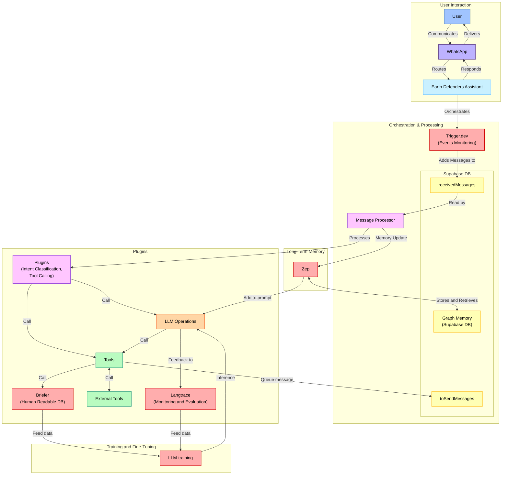

<h1 align="center">Development</h1>

<p align="center">
    Welcome to the <strong>Earth Defenders Assistant</strong> development documentation. This guide provides essential information for developers contributing to our platform, which leverages <a href="https://wwebjs.dev/">whatsapp-web.js</a> for creating customizable WhatsApp bots. Our system employs a flexible plugin architecture to support a wide range of applications, enabling the deployment of personalized bots tailored to diverse community needs.
    <br />
    <br />
    <a href="#getting-started"><strong>Getting Started</strong></a> ·
    <a href="#architecture"><strong>Architecture</strong></a> ·
    <a href="#contributing"><strong>Contributing</strong></a> ·
    <a href="#deployment"><strong>Deployment</strong></a>
</p>

## Getting Started

### Prerequisites

- **Node.js** (v14 or later)
- **[Bun](https://bun.sh/)** (v1.1.30)
- **[uv](https://docs.astral.sh/uv/)**
- **Git**
- **Docker** (optional, for containerized deployment)

**Installing**

```bash
curl -o- https://raw.githubusercontent.com/nvm-sh/nvm/v0.40.1/install.sh | bash # install Node Version Manager
curl -fsSL https://bun.sh/install | bash # Install Bun NodeJS package manager and runtime
curl -LsSf https://astral.sh/uv/install.sh | sh # Install uv Python package manager
```

### External Services

| Service                             | Purpose                                   |
| ----------------------------------- | ----------------------------------------- |
| [Supabase](https://supabase.com/)   | Backend-as-a-Service (BaaS) platform      |
| [Trigger.dev](https://trigger.dev/) | Workflow automation and job scheduling    |
| [OpenPanel](https://openpanel.dev/) | Analytics and data visualization          |
| [Upstash](https://upstash.com/)     | Redis-compatible database and caching     |
| [Sentry](https://sentry.io/)        | Error tracking and performance monitoring |

### Installation

Clone this repo locally with the following command:

```bash
git clone https://github.com/digidem/earth-defender-assistant.git
cd earth-defenders-assistant
```

1. Install dependencies using bun:

```sh
bun i
```

2. Copy `.env.example` to `.env` and update the variables.

```sh
# Copy .env.example to .env for each app
cp packages/simulator/.env.example packages/simulator/.env
cp packages/jobs/.env.example packages/jobs/.env
cp apps/api/.env.example apps/api/.env
cp apps/dashboard/.env.example apps/dashboard/.env
cp apps/landingpage/.env.example apps/landingpage/.env
cp apps/whatsapp/.env.example apps/whatsapp/.env
cp deploy/trigger-stack/.env.example deploy/trigger-stack/.env
cp deploy/langtrace-stack/.env.example deploy/langtrace-stack/.env
```

3. Start the development server from either bun or turbo:

```ts
bun dev // starts simulator, Supabase api and Trigger.dev jobs
bun dev:deploy // 
bun dev:all // starts all services in development mode
bun dev:jobs // starts the Trigger.dev service in development mode
bun dev:whatsapp // starts the WhatsApp service in development mode
bun dev:dashboard // starts the dashboard in development mode
bun dev:api // starts the API service in development mode
bun dev:ai // starts the AI API service in development mode (uses Python uv)
bun dev:landingpage // starts the landing page in development mode
bun dev:email // starts the email service in development mode
bun dev:docs // starts the documentation service in development mode

// Database
bun migrate // run migrations
bun seed // run seed
```

If using local Trigger instance for development run `bun dev:deploy` before running `bun dev`. For using local Langtrace deploy with `bun deploy:langtrace`.

4. **Access the Applications:**

- Supabase Studio: Access the Supabase interface at [http://localhost:54323](http://localhost:54323) to manage your database, view API documentation, and perform other backend tasks.
- Trigger.dev Dashboard: Access the Trigger.dev dashboard at [http://localhost:3001](http://localhost:3001) to manage jobs.
- AI API: Visit [http://localhost:8000/docs](http://localhost:8000/docs) in your browser to access the documentation for the API.
- Dashboard: Visit [http://localhost:8080](http://localhost:8080) in your browser to access the main dashboard.
- Landing Page: Navigate to [http://localhost:8081](http://localhost:8081) to view the landing page.
- Documentation: Browse the documentation at [http://localhost:8082](http://localhost:8082).

5. **Add environmental variables for different APIs**

- Connect to Trigger instance by setting the correct `TRIGGER_PROJECT_ID` and `TRIGGER_API_URL` variables in the `packages/jobs/.env` file from [Local Trigger](http://localhost:3001/) or [Cloud Trigger](https://cloud.trigger.dev)
- Add the correct `TRIGGER_SECRET_KEY` to `apps/whatsapp/.env` and `packages/simulator/.env` from [Local Trigger](http://localhost:3001/) or [Cloud Trigger](https://cloud.trigger.dev) apikeys section ([docs](https://trigger.dev/docs/apikeys))
- Add the correct `SUPABASE_SERVICE_ROLE_KEY` to the `packages/jobs/.env` from [Local Supabase](http://localhost:54323/project/default/settings/api) or [Cloud Supabase](https://supabase.com/dashboard/)
- Add the correct `LANGTRACE_API_KEY` to the `.env` in `apps/ai_api/.env` and `packages/simulator/.env`
- Add valid `CEREBRAS_API_KEY` or `OPENAI_API_KEY` to `apps/ai_api/.env` from [Cerebras](https://cloud.cerebras.ai/platform) or [OpenAI](https://platform.openai.com/api-keys)
- Add a valid `GROQ_API_KEY` to `packages/simulator/.env` from [Groq Console](https://console.groq.com/keys)
- Add the correct `SERPER_API_KEY` to the `apps/ai_api/.env`

## Architecture

This project follows a modular architecture, organized as a Turborepo monorepo. Key components include:

- **Apps:** Front-end applications such as the landingpage, user dashboard and WhatsApp web interface.
- **Packages:** Shared libraries and utilities used across applications, including analytics, email templates, background jobs, key-value storage, logging, simulation tools, database clients, TypeScript types, and UI components.
- **Plugins:** Extensible AI service modules and plugins that can be integrated into the core applications, currently including grant analysis and evaluation tools with potential for additional domain-specific plugins.
- **Deploy:** Utilize Docker Compose and scripts for deploying services used by the applications.

### Tech Stack

[Turborepo](https://turbo.build) - Build system<br>
[Biome](https://biomejs.dev) - Linter, formatter<br>
[Supabase](https://supabase.com/) - Authentication, database, storage<br>
[Upstash](https://upstash.com/) - Cache and rate limiting<br>
[React Email](https://react.email/) - Email templates<br>
[Sentry](https://sentry.io/) - Error handling/monitoring<br>
[Trigger.dev](https://trigger.dev/) - Background jobs<br>
[OpenPanel](https://openpanel.dev/) - Analytics<br>
[Starlight](https://starlight.astro.build/) - Documentation<br>

### Directory Structure

```
.
├── apps                         # App workspace
│    ├── ai_api                  # Python FastAPI for exposing and calling AI plugins
│    ├── api                     # Supabase (API, Auth, Storage, Realtime, Edge Functions)
│    ├── dashboard               # User dashboard
│    ├── landingpage             # Product Landing Page
│    ├── whatsapp                # Whatsapp Web instance
│    └── docs                    # Product Documentation
├── packages                     # Shared packages between apps
│    ├── analytics               # OpenPanel analytics
│    ├── email                   # React email library
│    ├── jobs                    # Trigger.dev background jobs
│    ├── kv                      # Upstash rate-limited key-value storage
│    ├── logger                  # Logger library
│    ├── simulator               # Simulates scrapping and user interactions
│    ├── supabase                # Supabase - Queries, Mutations, Clients
│    ├── types                   # Shared TypeScript type definitions
│    ├── typescript-config       # Shared TypeScript configuration
│    └── ui                      # Shared UI components (Shadcn)
├── deploy                       # Deploy workspace
│    ├── langtrace               # Langtrace stack
│    ├── briefer-stack           # Briefer stack components
│    ├── supabase-stack          # Supabase (API, Auth, Storage, Realtime, Edge Functions)
│    ├── training-stack          # LLM-training framework stack
│    ├── trigger-stack           # Trigger.dev stack components
│    └── zep-stack               # Zep stack components
├── plugins                      # Plugin workspace
│    └── grant_plugin            # The AI grant plugin for EDA
├── tooling                      # Shared configuration that are used by the apps and packages
│    └── typescript              # Shared TypeScript configuration
├── .cursorrules                 # Cursor rules specific to this project
├── biome.json                   # Biome configuration
├── turbo.json                   # Turbo configuration
├── LICENSE
└── README.md
```

### Project Diagram



## Contributing

We welcome contributions from the community. To get started:

1. Fork the repository.
2. Create a new feature branch (`git checkout -b feature/your-feature-name`).
3. Commit your changes (`git commit -m 'Add your feature message'`).
4. Push to the branch (`git push origin feature/your-feature-name`).
5. Open a [Pull Request](https://github.com/digidem/earth-defenders-assistant/pulls).

Please adhere to the project's [Code of Conduct](./CODE_OF_CONDUCT.md) and ensure all tests pass before submitting your pull request.

## Deployment

For detailed deployment instructions, please refer to our comprehensive [Deployment Guide](./deploy/README.md). This guide provides step-by-step instructions for setting up and deploying each component of our stack.
