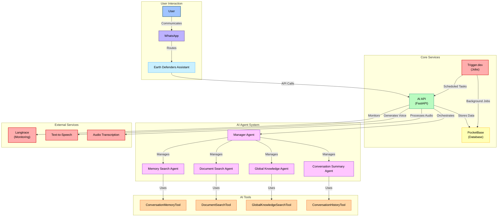

<h1 align="center">Development</h1>

<p align="center">
    Welcome to the <strong>Earth Defenders Assistant</strong> development documentation. This guide provides essential information for developers contributing to our platform, which leverages <a href="https://github.com/whiskeysockets/baileys">Baileys</a> for WhatsApp integration and a flexible AI agent architecture. Our system employs a modular design to support a wide range of applications, enabling the deployment of personalized AI assistants tailored to diverse community needs.
    <br />
    <br />
    <a href="#getting-started"><strong>Getting Started</strong></a> ·
    <a href="#architecture"><strong>Architecture</strong></a> ·
    <a href="#development-workflow"><strong>Development Workflow</strong></a> ·
    <a href="#contributing"><strong>Contributing</strong></a> ·
    <a href="#deployment"><strong>Deployment</strong></a>
</p>

## Getting Started

This project uses [Turborepo](https://turbo.build/repo/docs) as a monorepo architecture to manage multiple packages and applications. The codebase is split between TypeScript (for core processing, database interactions, and frontend applications) and Python (for AI/ML services and natural language processing).

### Prerequisites

- **Node.js** (v20 or later)
- **[Bun](https://bun.sh/)** (v1.1.33) - NodeJS manager
- **Python** (v3.11)
- **[uv](https://docs.astral.sh/uv/)** - Python manager
- **Git**
- **Docker** (optional, for containerized deployment)

**Installing Development Tools**

Make sure you have the necessary dependencies. The following commands will install the required development tools:

```bash
# Install Node Version Manager
curl -o- https://raw.githubusercontent.com/nvm-sh/nvm/v0.40.1/install.sh | bash

# Install Bun NodeJS package manager and runtime
curl -fsSL https://bun.sh/install | bash

# Install uv Python package manager
curl -LsSf https://astral.sh/uv/install.sh | sh
```

Install Node.js v20 and pin it using nvm:

```bash
nvm install 20
nvm use 20
nvm alias default 20
```

And Python 3.11 and pin it using uv:

```bash
uv python install 3.11
uv python pin 3.11
```

### External Services

The platform's core services can be run either locally or accessed via cloud providers during development. While local setup instructions are available in the deployment section, running all services locally can be resource-intensive. Each service provider offers a free tier that you can use by creating an account, making cloud-based development a viable alternative for resource-constrained environments.

| Service                             | Purpose                                | Required   |
| ----------------------------------- | -------------------------------------- | ---------- |
| [PocketBase](https://pocketbase.io/) | Backend-as-a-Service (BaaS) platform   | Yes        |
| [Trigger.dev](https://trigger.dev/) | Workflow automation and job scheduling | Optional   |
| [Langtrace](https://langtrace.ai/)  | LLM observability and monitoring       | For AI Dev |

### Optional Monitoring Services

| Service                             | Purpose                                   |
| ----------------------------------- | ----------------------------------------- |
| [OpenPanel](https://openpanel.dev/) | Analytics and data visualization          |
| [Upstash](https://upstash.com/)     | Redis-compatible database and caching     |
| [Sentry](https://sentry.io/)        | Error tracking and performance monitoring |

### Installation

Clone this repo locally with the following command:

```bash
git clone https://github.com/digidem/earth-defenders-assistant.git
cd earth-defenders-assistant
```

1. Install dependencies using bun:

```bash
bun install
```

2. Copy configuration files:

```bash
# Copy config files
cp config.example.yaml config.yaml
```

3. Configure your environment:

Edit `config.yaml` with your service credentials and settings. Key sections to configure:

- **API Keys**: Add your AI model API keys (OpenAI, Google AI Studio, etc.)
- **Services**: Configure database URLs, ports, and service endpoints
- **Access Control**: Set up allowed/blocked users for WhatsApp
- **AI Models**: Configure model providers and settings

4. Start the development services:

```bash
# Start all core services
bun dev:api      # Starts PocketBase API service
bun dev:ai       # Starts AI API service (Python FastAPI)
bun dev:whatsapp # Starts WhatsApp client
```

## Development Workflow

### Core Development Commands

The project uses a simplified development workflow with three main services:

```bash
# Install dependencies
bun install

# Start core services
bun dev:api      # PocketBase backend (port 8090)
bun dev:ai       # AI API service (port 8083)
bun dev:whatsapp # WhatsApp client

# Additional development commands
bun dev:all      # Start all services in parallel
bun dev:dashboard # Start dashboard (port 8080)
bun dev:landingpage # Start landing page (port 8081)
bun dev:docs     # Start documentation (port 8082)
bun dev:jobs     # Start Trigger.dev jobs
bun dev:email    # Start email service
bun dev:simulator # Start AI simulator for testing
```

### Service Access Points

When running in development mode, you can access:

- **Dashboard**: [http://localhost:8080](http://localhost:8080)
- **Landing Page**: [http://localhost:8081](http://localhost:8081)
- **Documentation**: [http://localhost:8082](http://localhost:8082)
- **AI API Docs**: [http://localhost:8083/docs](http://localhost:8083/docs)
- **PocketBase Admin**: [http://localhost:8090/_/](http://localhost:8090/_/)

### WhatsApp Development

For WhatsApp development:

1. Start the WhatsApp service: `bun dev:whatsapp`
2. Scan the QR code that appears in the terminal
3. The bot will be ready to receive messages
4. Test with commands like `!help` and `!ping`

### AI Development

The AI API service provides:

- **Agent Management**: Multi-agent system with specialized tools
- **Memory Systems**: Conversation history and semantic search
- **Document Processing**: PDF/CSV upload and analysis
- **Text-to-Speech**: Voice generation for responses
- **Audio Transcription**: Voice message processing

## Architecture

This project follows a modular architecture, organized as a Turborepo monorepo. Key components include:

- **Apps:** Front-end applications such as the landing page, user dashboard, WhatsApp client, and AI API.
- **Packages:** Shared libraries and utilities used across applications, including configuration management, logging, TypeScript types, and UI components.
- **AI Agents:** Extensible AI service modules with specialized tools for different tasks.
- **Deploy:** Docker Compose and scripts for deploying supporting services.

### Tech Stack

[Turborepo](https://turbo.build) - Build system<br>
[Biome](https://biomejs.dev) - Linter, formatter<br>
[PocketBase](https://pocketbase.io/) - Backend-as-a-Service (database, auth, storage)<br>
[Trigger.dev](https://trigger.dev/) - Background jobs<br>
[FastAPI](https://fastapi.tiangolo.com/) - Python web framework<br>
[Baileys](https://github.com/whiskeysockets/baileys) - WhatsApp Web API<br>
[Langtrace](https://www.langtrace.ai/) - LLM monitoring and evaluation<br>
[Starlight](https://starlight.astro.build/) - Documentation<br>
[Upstash](https://upstash.com/) - Cache and rate limiting<br>
[React Email](https://react.email/) - Email templates<br>
[Sentry](https://sentry.io/) - Error handling/monitoring<br>
[OpenPanel](https://openpanel.dev/) - Analytics<br>

### Directory Structure

```
.
├── apps                         # App workspace
│    ├── ai_api                  # Python FastAPI for AI services and agents
│    ├── api                     # PocketBase backend service
│    ├── dashboard               # User dashboard
│    ├── landingpage             # Product Landing Page
│    ├── whatsapp                # WhatsApp client using Baileys
│    └── docs                    # Product Documentation
├── packages                     # Shared packages between apps
│    ├── analytics               # OpenPanel analytics
│    ├── config                  # Centralized configuration management
│    ├── email                   # React email library
│    ├── jobs                    # Trigger.dev background jobs
│    ├── kv                      # Upstash rate-limited key-value storage
│    ├── logger                  # Logger library
│    ├── simulator               # Simulates user interactions
│    ├── supabase                # Database queries and clients
│    ├── types                   # Shared TypeScript type definitions
│    ├── typescript-config       # Shared TypeScript configuration
│    └── ui                      # Shared UI components (Shadcn)
├── deploy                       # Deploy workspace
│    ├── langtrace               # Langtrace stack
│    ├── trigger-stack           # Trigger.dev stack components
│    └── supabase-stack          # PocketBase stack components
├── plugins                      # Plugin workspace
│    └── grant_plugin            # The AI grant plugin for EDA
├── tooling                      # Shared configuration
│    └── typescript              # Shared TypeScript configuration
├── .cursorrules                 # Cursor rules specific to this project
├── biome.json                   # Biome configuration
├── turbo.json                   # Turbo configuration
├── config.yaml                  # Centralized configuration
├── config.example.yaml          # Configuration template
├── LICENSE
└── README.md
```

### AI Agent Architecture

The AI system uses a multi-agent architecture with specialized tools:

#### Core Agents
- **Manager Agent**: Orchestrates other agents and handles multi-modal input
- **Document Search Agent**: Searches through uploaded documents
- **Memory Search Agent**: Performs semantic search on conversation history
- **Global Knowledge Agent**: Searches shared knowledge base
- **Conversation Summary Agent**: Generates conversation summaries

#### Tools
- **ConversationMemoryTool**: Semantic search in conversation history
- **DocumentSearchTool**: Search through stored documents
- **GlobalKnowledgeSearchTool**: Search global knowledge base
- **ConversationHistoryTool**: Retrieve conversation history by date

### Project Diagram



## Contributing

We welcome contributions from the community. To get started:

1. **Fork the repository**
2. **Create a feature branch**: `git checkout -b feature/your-feature-name`
3. **Make your changes**: Follow the coding standards below
4. **Test your changes**: Ensure all services work correctly
5. **Commit your changes**: `git commit -m 'Add your feature message'`
6. **Push to the branch**: `git push origin feature/your-feature-name`
7. **Open a Pull Request**: [Create PR](https://github.com/digidem/earth-defenders-assistant/pulls)

### Coding Standards

#### TypeScript/JavaScript
- Use TypeScript with strict type checking
- Follow Biome formatting and linting rules
- Use descriptive variable and function names
- Add proper error handling and logging
- Write meaningful commit messages

#### Python
- Follow PEP 8 style guidelines
- Use type hints for all functions
- Add docstrings for public functions
- Use async/await for I/O operations
- Implement proper error handling

#### Configuration
- Use the centralized `config.yaml` system
- Add new configuration options to both YAML and TypeScript types
- Document new configuration options
- Provide sensible defaults

#### Testing
- Test your changes locally before submitting
- Ensure all services start correctly
- Test the WhatsApp integration if applicable
- Verify AI agent functionality

### Development Best Practices

1. **Start Small**: Begin with simple changes and gradually add complexity
2. **Test Locally**: Always test your changes in the local development environment
3. **Use Configuration**: Leverage the centralized config system for all settings
4. **Follow Patterns**: Study existing code to understand the project patterns
5. **Document Changes**: Update documentation when adding new features
6. **Error Handling**: Implement proper error handling and user feedback

## Deployment

For detailed deployment instructions, please refer to our comprehensive [Deployment Guide](./deploy/README.md). This guide provides step-by-step instructions for setting up and deploying each component of our stack.

### Quick Deployment

For basic deployment:

1. **Configure Environment**: Set up `config.yaml` with production values
2. **Build Applications**: `bun build`
3. **Deploy Services**: Use the deployment scripts in the `deploy/` directory
4. **Monitor**: Set up monitoring and logging for production

### Production Considerations

- **Security**: Ensure all API keys and secrets are properly secured
- **Scaling**: Configure services for expected load
- **Monitoring**: Set up comprehensive monitoring and alerting
- **Backup**: Implement regular database backups
- **SSL**: Use HTTPS for all external communications

---

For more information about the Earth Defenders Assistant platform and its components, please refer to the main project documentation and the [ROADMAP](./ROADMAP.md) for future development plans.
